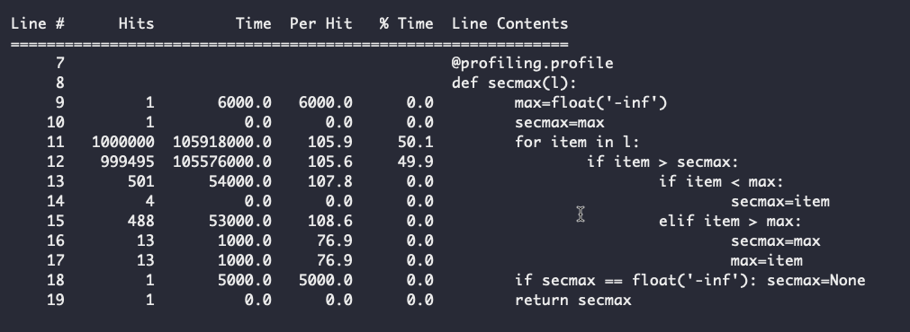

# secmax

Select the second largest integer out of a random list
but mostly show the power and importance of tests

## get started
prepare: `brew install python vim` or `choco install python vim`
install requirements: `pip install --requirements.txt`
in a seperate terminal run: `pytest-watch`
select your preferred algorithm in 'secmax.py'
measure time: `python -m timeit -n 1000 -s "import secmax,random" "secmax.secmax([random.randint(-10000,10000) for x in range(200)])"`

## line_profile:

 `import profile ` and add the `@profiling.profile` decorator to the function you wish to profile.

Then at the end call `profiling.print_stats()` to print the results.

## learned
- [line_profiler](https://pypi.org/line-profiler) is cool
- Tests are not only there to verify functionality, but to ensure it in the future!
- if you don't know *EXACTLY 100%* what your doing you are better off using standard library

## questions

All timing errors are positive?

how is python importing so confusing?
